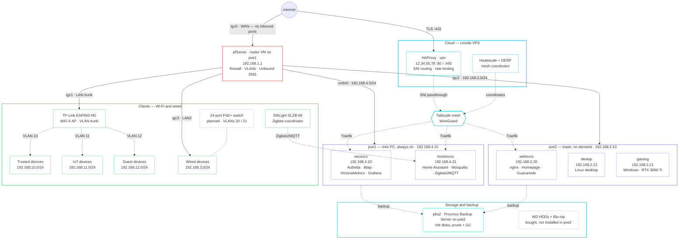

# Architecture

A self-hosted private cloud: two Proxmox hosts at home, one cloud VPS as the public
front door, 6 VMs, and ~30 containerized services — all reproducible from this repo.

Goals:

- Self-hosted identity, monitoring, home automation, game streaming, and remote access
- No reliance on cloud providers, except a single cheap VPS for the public endpoint
- Everything reproducible from the git repo (see [Development](development.md))
- Small always-on power footprint; heavy hardware powers on only when needed

Deep dives: [Networking](networking.md) · [Security](security.md) · [Services](services.md)

> All IPs and domains in these docs are the placeholder values from `vars.template.yml`.
> Real values live in the gitignored `vars.yml`.

## System overview

Public traffic enters only through HAProxy on the VPS, which routes by TLS SNI over a
Tailscale mesh (coordinated by self-hosted Headscale) to a Traefik instance on the
target VM. Internal clients skip all of that: split-horizon DNS points them straight
at the VMs. See [Networking](networking.md) for the full path.

Solid links are physical paths: internet transit, NIC ports, the LAN trunk, the
`vmbr0` bridge. Dotted links are logical, wireless, or not yet built: Tailscale
tunnels, tagged WiFi VLANs, Zigbee, backup jobs. Grey dashed boxes are hardware that
is bought or planned but not yet in service.

## Hardware

### pve1: always-on mini PC

Fanless "router box" mini PC from AliExpress; low idle power (~15–20 W) since it runs 24/7.

| Component | Spec |
|-----------|------|
| CPU | Intel Celeron N5105 (4 cores) |
| RAM | 32 GB DDR4 (2×16 GB) |
| Storage | 500 GB WD NVMe SSD |
| NICs | 4× Intel i226 2.5 GbE (`igc0`–`igc3`), PCI-passed to the pfSense VM |

The four physical NICs are passed through to the pfSense router VM, so pve1 itself
reaches the network only via the virtual bridge `vmbr0` (no physical port — pfSense is
its gateway). It hosts the router, `secsvcs`, and `homesvcs`, plus the trust roots:
private CA, SSH CA, SOPS/AGE secrets, and provisioning scripts. It should be the most
secure host in the system.

### pve2: on-demand tower

Custom build in a Phanteks P300A case; ~30 W idle, ~300 W max. Powered on when needed
(gaming, development, GPU workloads) and off otherwise.

| Component | Spec |
|-----------|------|
| Motherboard | Kontron K3843-B (µATX, Intel B660) |
| CPU | Intel Core i5-13500 (6 P-cores + 8 E-cores) |
| RAM | 32 GB DDR5-4800 (2×16 GB) |
| Storage | 1 TB WD Black SN850X NVMe (OS/VMs) + 500 GB WD Red SATA SSD |
| GPU | Nvidia RTX 3060 Ti — passed to the gaming VM |
| Accelerators | Nvidia Tesla P4 (voice pipeline STT), Coral TPU (camera object detection), Intel iGPU (Quick Sync) |
| PSU | Corsair RM550x 550 W |

pve2 runs `websvcs`, `devtop`, the Windows `gaming` VM, and Proxmox Backup Server
(`pbs2`). GPU/PCI passthrough setup is covered in [the GPU guide](guides/gpu.md) and
[the Proxmox guide](guides/proxmox.md).

### vpn: cloud VPS

Smallest Linode shared-CPU instance. The only machine with a public IP. Runs HAProxy,
Headscale, Tailscale, and the GeoIP map generator directly on the host (no containers).

### Network gear and peripherals

| Device | Status | Notes |
|--------|--------|-------|
| TP-Link EAP660 HD WiFi 6 AP | deployed | wall-mounted, tagged VLANs for trusted/IoT/guest SSIDs |
| SMLight SLZB-06 Zigbee adapter | deployed | used by Zigbee2MQTT on `homesvcs` |
| HDDs (WD 3.5") + Blu-ray drive | bought, not yet installed | future bulk media/backup storage on pve2 |
| 24-port PoE+ managed switch | planned | unblocks the wired VLANs (20/21) |
| 4G LTE failover modem | planned | pfSense WAN failover |
| Rack, patch panel, UPS, PiKVM | planned | |

## Nodes

| Hostname | Purpose | Host machine |
|----------|---------|--------------|
| pve1 | Proxmox hypervisor (mini PC), always on | self |
| pve2 | Proxmox hypervisor (tower), intermittent, has accelerators | self |
| vpn | VPN coordinator and public endpoint (Headscale, HAProxy) | Linode |
| router | Routing, firewall and VLAN management (pfSense) | pve1 |
| secsvcs | Core services: auth, user management, monitoring | pve1 |
| homesvcs | Home automation (Home Assistant, MQTT, ESPHome) | pve1 |
| websvcs | User-facing / non-critical web apps | pve2 |
| devtop | Linux desktop for development and general usage | pve2 |
| gaming | Windows desktop for PC gaming (Sunshine streaming) | pve2 |

VMs (rather than bare-metal containers) provide isolation, snapshotting, and a clear
blast radius: each VM owns one concern and its own Traefik ingress, so a compromise or
a bad deploy stays contained.

## Key design decisions

Recorded as ADRs in `docs/adr/`:

- [Podman quadlets + systemd instead of Kubernetes or Compose](adr/0001-podman-quadlets-over-kubernetes.md)
- [HAProxy in TCP/SNI-passthrough mode at the edge](adr/0002-haproxy-sni-passthrough.md)
- [Self-hosted Headscale instead of managed Tailscale](adr/0003-self-hosted-headscale.md)
- [SOPS + AGE for secrets instead of Vault](adr/0004-sops-age-secrets.md)
- [SSH forced-command dispatcher instead of a config-management agent](adr/0005-ssh-forced-command-dispatcher.md)

## Secrets

Secrets use SOPS + AGE encryption and are written to disk encrypted. A custom
integration injects them into Podman containers at startup; `*.j2.j2` second-pass
templates render secret values into config files. See
[Security](security.md#secrets) for the full pipeline.
