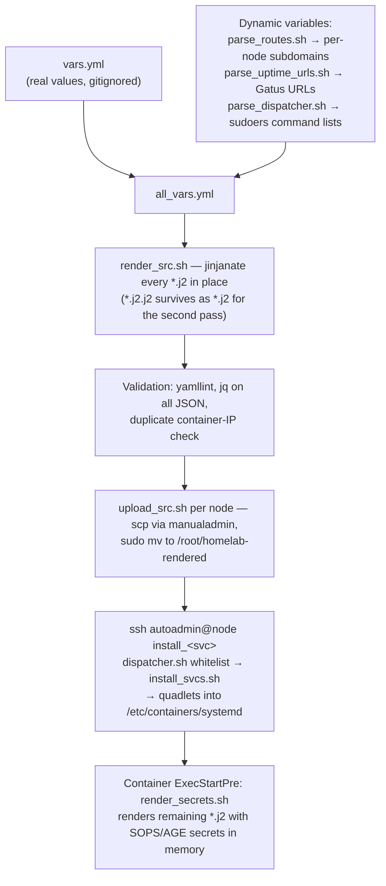

# Development

## Setup

- Setup your local computer. Here are the instructions for a [Mac](./guides/mac_personal.md.j2)
- Create a `vars.yml` file from the `vars.template.yml` example

## Code structure

### Templating System

- `vars.yml` contains specific/personal values for rendering (gitignored), `vars.template.yml` is an example
- All `*.j2` files are processed through Jinja2 via `jinjanate` at render time
- `*.j2.j2` files undergo a *second* render pass at service startup (e.g., for secrets injection via `src/podman/render_secrets.sh`)
- `tools/parse_routes.sh` and `tools/parse_uptime_urls.sh` generate additional variables dynamically during rendering

### Service Structure

Some directories under `src/` map to a node. They may contain:
- `install_svcs.sh` — Copies configs to `/etc/opt/<service>/` and container files to `/etc/containers/systemd/`, then reloads systemd
- `commands.sh` - Other tasks that run as root and are triggered remotely
- `traefik/` — Reverse proxy routing rules (HTTP routers, middlewares)
- `secrets_template.yaml` — Template for SOPS-encrypted secrets
The remaining directories under `src/` typically map to a service. They may contain:
- `*.container` — Podman quadlet systemd unit files
- `*.volume` — Podman volume definitions
- Service configuration files

## Deployment pipeline

From template to running container, a change passes through five stages:



Only validated output ever ships, and secrets only materialize inside the node at
container start — the rendered tree on disk still has secret placeholders in its
`*.j2` files. `deploy_src.sh` runs render + upload for every node in one command
(the gaming VM is skipped when powered off).

## Deploy changes

Render and deploy to all nodes:
```bash
tools/deploy_src.sh
```

Render templates locally:
```bash
tools/render_src.sh /tmp/homelab-rendered
```
Rendering also validates YAML, JSON, and checks for duplicate container IPs.

Upload rendered files to a specific server:
```bash
tools/upload_src.sh <hostname> /tmp/homelab-rendered
```

### Update a web service

- Determine which VM the service is supposed to run on
- Install / update the relevant service:
```bash
ssh manualadmin@secsvcs
sudo /root/homelab-rendered/src/secsvcs/install_svcs.sh SERVICE
```

### Add a new service

1. Add Traefik route config for the VM
1. Create service container and config files in `src/<service>/`
1. If cross-VM TLS is needed, add cert/key gen to `src/certificates/` and update `commands.sh`
1. Add service to `install_svcs.sh`
1. Update Authelia config if OIDC auth is available (`src/authelia/`)
1. Add Gatus uptime check (`src/gatus/config.yaml`)
1. Add Homepage dashboard entry (`src/homepage/`)
1. Update the relevant guide in `docs/guides/`
