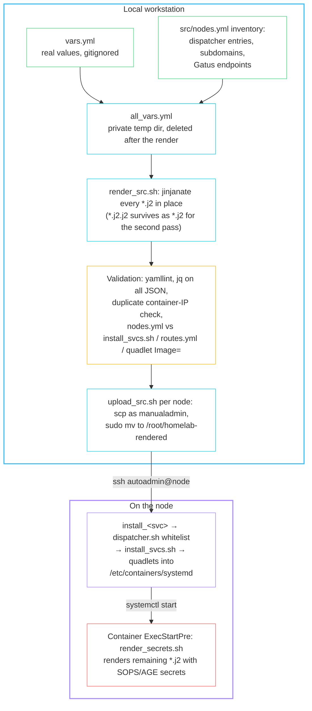

# Development

## Setup

- Setup your local computer. Here are the instructions for a [Mac](./guides/mac_personal.md)
- Create a `vars.yml` file from the `vars.template.yml` example

## Code structure

### Templating System

- `vars.yml` contains specific/personal values for rendering (gitignored), `vars.template.yml` is an example
- All `*.j2` files are processed through Jinja2 via `jinjanate` at render time
- `*.j2.j2` files undergo a *second* render pass at service startup (e.g., for secrets injection via `src/podman/render_secrets.sh`)
- `src/nodes.yml` is the node inventory: each node's dispatcher entries (services in install order, other commands) and each service's subdomain, Gatus endpoint and container image facts (`upstream`/`build`, `update_last`, `containers`). `render_src.sh` appends it to `vars.yml` as `nodes:` in a private temp `all_vars.yml`, and templates import `src/nodes.jinja` for the lists derived from it (dispatcher cases, sudoers grants, OliveTin buttons, DNS/SNI subdomains, uptime endpoints, image update order). See [ADR 0006](adr/0006-node-inventory.md)

### Service Structure

Some directories under `src/` map to a node. They may contain:
- `install_svcs.sh`: copies configs to `/etc/opt/<service>/` and container files to `/etc/containers/systemd/`, then reloads systemd
- `commands.sh` - Other tasks that run as root and are triggered remotely
- `traefik/`: reverse proxy routing rules (HTTP routers, middlewares)
- `secrets_template.yaml`: template for SOPS-encrypted secrets

The remaining directories under `src/` typically map to a service. They may contain:
- `*.container`: Podman quadlet systemd unit files
- `*.volume`: Podman volume definitions
- Service configuration files

### Diagrams

Docs diagrams are Mermaid, rendered inline by GitHub. Conventions kept across all of
them so they read as one set:

- Box color groups related roles within a diagram; fills are transparent and only the
  stroke is colored, so diagrams stay legible in both the light and dark GitHub themes.
- Grey dashed boxes are hardware that is planned but not in service.
- Most edges carry the link, protocol, or script name as a label.
- In the two network topology diagrams only, solid edges are physical paths and dotted
  edges are logical ones (tunnels, tagged VLANs, virtual NICs).
- Sequence diagrams use `autonumber` and activation bars so the request and its
  return path are both visible.

## Deployment pipeline

From template to running container, a change passes through five stages:


```mermaid
flowchart TB
    subgraph local["Local workstation"]
        vars["vars.yml<br/>real values, gitignored"]
        inventory["src/nodes.yml inventory:<br/>dispatcher entries, subdomains,<br/>Gatus endpoints"]
        allvars["all_vars.yml<br/>private temp dir, deleted after the render"]
        render["render_src.sh: jinjanate every *.j2 in place<br/>(*.j2.j2 survives as *.j2 for the second pass)"]
        validate["Validation: yamllint, jq on all JSON,<br/>duplicate container-IP check,<br/>nodes.yml vs install_svcs.sh / routes.yml / quadlet Image="]
        upload["upload_src.sh per node: scp as manualadmin,<br/>sudo mv to /root/homelab-rendered"]
    end

    subgraph node["On the node"]
        dispatch["install_&lt;svc&gt; → dispatcher.sh whitelist<br/>→ install_svcs.sh → quadlets into<br/>/etc/containers/systemd"]
        second["Container ExecStartPre: render_secrets.sh<br/>renders remaining *.j2 with SOPS/AGE secrets"]
    end

    vars --> allvars
    inventory --> allvars
    allvars --> render --> validate --> upload
    upload -- "ssh autoadmin@node" --> dispatch
    dispatch -- "systemctl start" --> second

    style local stroke:#38bdf8,stroke-width:2px,fill:transparent
    style node stroke:#a78bfa,stroke-width:2px,fill:transparent
    classDef input stroke:#4ade80,fill:transparent
    classDef step stroke:#22d3ee,fill:transparent
    classDef onnode stroke:#a78bfa,fill:transparent
    classDef check stroke:#fbbf24,fill:transparent
    classDef secret stroke:#f87171,fill:transparent
    class vars,inventory input
    class allvars,render,upload step
    class dispatch onnode
    class validate check
    class second secret
```

Only validated output ever ships, and secrets only materialize inside the node at
container start; the rendered tree on disk still has secret placeholders in its
`*.j2` files. `deploy_src.sh` runs render + upload for every node in one command
(the gaming VM is skipped when powered off).

## Deploy changes

Render and deploy to all nodes:
```bash
tools/deploy_src.sh
```

Render templates locally:
```bash
out=$(mktemp -d)/homelab-rendered
tools/render_src.sh "$out"
```
Without an argument `render_src.sh` picks a private temp dir itself and prints it.
The output holds real values, so keep it out of shared paths such as a fixed
`/tmp/homelab-rendered`; `vars.yml`, `.git`, `planning` and `notes` are never copied
into it. The directory must be named `homelab-rendered`, since `upload_src.sh` moves
it into place by that name.

Rendering also validates YAML, JSON, checks for duplicate container IPs
(`tools/validate_rendered.sh`), and checks
`src/nodes.yml` against the scripts and routes it describes: each node's `services`
must be exactly its `install_svcs.sh` cases, every command must be a case in its
script, subdomains must be unique, the secsvcs/homesvcs subdomains must match the
`Host()` rules in their `traefik/routes.yml`, and each image's quadlet (copied by the
service's case) must have `Image=localhost/` + its `upstream` ref without the registry
host, or `Image=localhost/<build>:latest`.

Upload rendered files to a specific server:
```bash
tools/upload_src.sh <hostname> "$out"
```

### Pre-commit hook and `rendered/`

`.githooks/pre-commit` renders the staged tree against `vars.template.yml` in a temp
dir, which runs every check above, then runs `shellcheck -x --severity=warning` over
the rendered `*.sh` files (so `*.sh.j2` scripts are checked with their Jinja filled
in). If everything passes it replaces `rendered/` with that render and stages it, so
every commit carries a readable copy of what the nodes get, with example values.
`rendered/` is generated: edit the templates, never the copy. It is left out of the
deploy render and marked `linguist-generated` so GitHub collapses it in diffs. The
hook takes about 7 s. Activate it once per clone:
```bash
git config core.hooksPath .githooks
```
Skip it for one commit with `git commit --no-verify`; `rendered/` is then stale until
the next commit that runs the hook.

### Update a web service

- Determine which VM the service is supposed to run on
- Install / update the relevant service:
```bash
ssh manualadmin@secsvcs
sudo /root/homelab-rendered/src/secsvcs/install_svcs.sh SERVICE
```

### Add a new service

1. Add Traefik route config for the VM
1. Create service container and config files in `src/<service>/`
1. If cross-VM TLS is needed, add cert/key gen to `src/certificates/` and update `commands.sh`
1. Add service to `install_svcs.sh`
1. Add it under the node's `services` in `src/nodes.yml`, in install order, with its
   `subdomain` and, to monitor it in Gatus, `uptime` (and `uptime_path` if the health
   check isn't `/`). This adds the dispatcher case, sudoers grant, OliveTin button,
   DNS/SNI routing and uptime check
1. Update Authelia config if OIDC auth is available (`src/authelia/`)
1. Add Homepage dashboard entry (`src/homepage/`)
1. Update the relevant guide in `docs/guides/`
