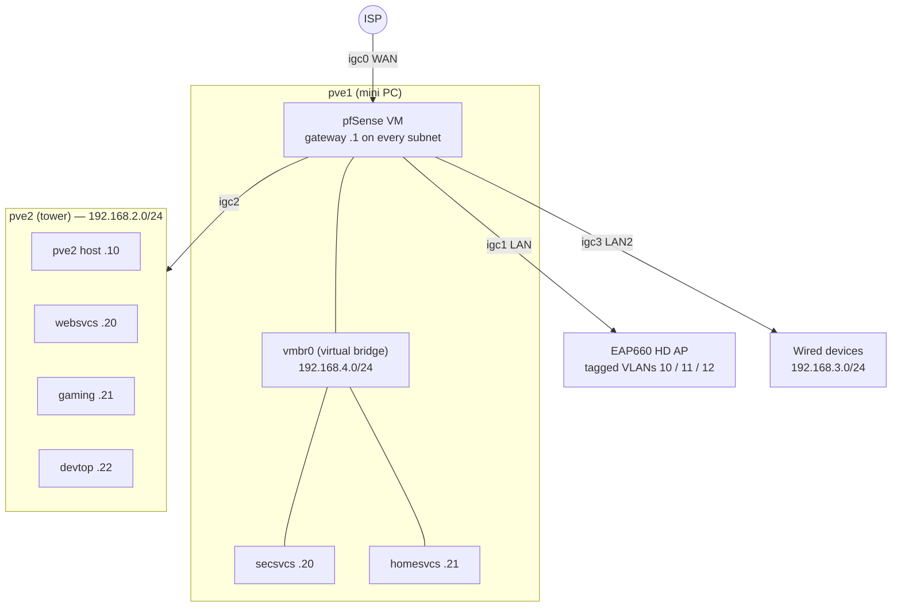
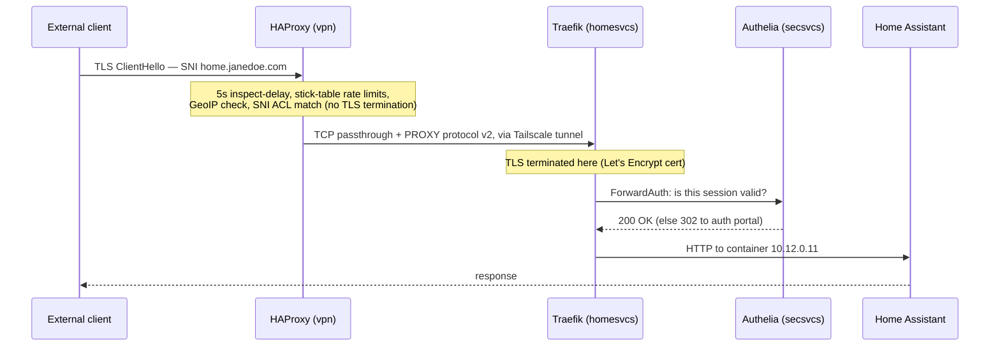

# Networking

How traffic moves: physical topology, VLANs, DNS, and the three-tier ingress chain.
All addresses below are the placeholder values from `vars.template.yml`.

The ground-truth configs are [`src/dns/unbound.conf.j2`](../src/dns/unbound.conf.j2),
[`src/haproxy/haproxy.cfg.j2`](../src/haproxy/haproxy.cfg.j2), the per-node
`src/<node>/traefik/` directories, and [the router guide](guides/router.md.j2).

## Physical and logical topology

pfSense runs as a VM on pve1 with all four of the mini PC's 2.5 GbE NICs
(Intel i226, `igc0`–`igc3`) PCI-passed through to it. The Proxmox host itself has no
physical uplink: it sits on the virtual bridge `vmbr0`, with the pfSense VM as its
gateway.

| pfSense interface | Physical port | Network | Subnet |
|-------------------|---------------|---------|--------|
| WAN | igc0 | ISP uplink | (DHCP from ISP) |
| LAN | igc1 | WiFi AP trunk (VLAN parent) | 192.168.1.0/24 |
| pve2 | igc2 | pve2 uplink | 192.168.2.0/24 |
| LAN2 | igc3 | Wired devices | 192.168.3.0/24 |
| OPT (vmbr0) | — virtual — | pve1 + its VMs | 192.168.4.0/24 |

Each VM gets a static IP in its host's subnet via a systemd `net.network` file, and
each container VM runs its own Podman bridge network for containers:

| Node | VM IP | Container subnet |
|------|-------|------------------|
| secsvcs | 192.168.4.20 | 10.10.0.0/24 |
| websvcs | 192.168.2.20 | 10.11.0.0/24 |
| homesvcs | 192.168.4.21 | 10.12.0.0/24 |

Containers have static IPs within their subnet (see [Services](services.md)); the
render pipeline rejects duplicate container IPs at build time.

## VLANs

VLANs exist on the WiFi trunk today; wired VLANs are defined but waiting on a managed
switch. Each VLAN is its own pfSense interface and /24, with the VLAN ID as the third
octet, and its own DHCP scope.

| VLAN | Name | Subnet | SSID | Status |
|------|------|--------|------|--------|
| 10 | WiFiTrusted | 192.168.10.0/24 | cool-house / cool-house5 | active |
| 11 | WiFiIoT | 192.168.11.0/24 | machines (2.4 GHz) | active |
| 12 | WiFiGuest | 192.168.12.0/24 | welcome (5 GHz) | active |
| 20 | WiredTrusted | 192.168.20.0/24 | — | planned (needs managed switch) |
| 21 | WiredIoT | 192.168.21.0/24 | — | planned |

The intent is three-tier segmentation: trusted devices, poorly-secured IoT devices,
and internet-only guests. IoT → trusted traffic is blocked by default with specific
whitelisted services (Home Assistant, MQTT); the guest VLAN routes only to the
internet. The AP's management interface lives on the trusted VLAN.

## DNS

Unbound on pfSense serves split-horizon DNS for the site domain:

- Every host and VM gets a `local-zone` redirect (e.g. `secsvcs.janedoe.com`).
- Per-service records are auto-generated at render time: `tools/parse_routes.sh`
  extracts the subdomains each node's Traefik serves, and the template loops emit
  records pointing at that node's VM IP (e.g. `auth.janedoe.com → 192.168.4.20`).
- A catch-all `janedoe.com A <websvcs>` record makes websvcs the default for the apex
  and anything unlisted.
- Internal-only names exist for `pgdb.` (Postgres) and `mqtt.` (Mosquitto) — these
  resolve nowhere on the public internet.
- `vpn.janedoe.com` is `transparent`: it resolves via public DNS to the VPS, even for
  internal clients.

Public DNS (at the registrar) points the domain and its subdomains at the VPS's public
IP (12.34.56.78). So the same URL works everywhere: outside the house you traverse
HAProxy; inside, Unbound short-circuits you straight to the VM.

DHCP hands clients the router as primary DNS with 1.1.1.1 as fallback, plus the site
domain as a search domain.

## mDNS across VLANs

Multicast DNS (device discovery for HomeKit, Chromecast, ESPHome, etc.) does not cross
router boundaries, which VLAN segmentation otherwise breaks. Three pieces bridge it:

- The pfSense **mDNS-Bridge package** repeats mDNS between VLANs — trusted VLANs only;
  the guest VLAN deliberately gets no discovery.
- A host-level **`mdns_repeater`** service on the container VMs repeats mDNS between
  the VM's NIC and its internal Podman bridge, so containers (e.g. Home Assistant) can
  discover devices.
- A firewall rule allows UDP/5353 to the multicast range across the bridged VLANs.

Gotcha: `avahi-daemon` must be disabled where `mdns_repeater` runs — it silently
intercepts queries first. `test/mdns.js` is a probe script for verifying which service
types are visible from a given VLAN.

## Ingress: the three-tier chain

External requests cross three layers, each with a distinct job:

1. **HAProxy on vpn** — the only public listener (:80, :443). Runs in TCP mode for
   HTTPS: it inspects the TLS ClientHello's SNI and routes to a backend VM *without
   terminating TLS*. Rate limiting, geo-blocking, and attack-path filtering happen
   here (see [Security](security.md#the-edge-haproxy)).
2. **Tailscale mesh** — HAProxy's backends are Tailscale addresses. The VPS funnels
   public traffic into the private network over WireGuard, filling a DMZ-like role.
   Headscale (self-hosted, on the same VPS) coordinates the mesh; its embedded DERP
   relay handles peers that can't connect directly.
3. **Traefik on each VM** — terminates TLS (Let's Encrypt certs), enforces
   Authelia ForwardAuth, and routes by hostname to the local container. HAProxy speaks
   PROXY protocol v2 to Traefik so the real client IP survives the hops.

Plain HTTP (:80) is handled in HTTP mode: HAProxy filters attack paths, then passes
traffic through so Traefik can answer ACME HTTP-01 challenges and redirect the rest
to HTTPS.

Internal clients never touch tiers 1–2: Unbound resolves the service name straight to
the VM, where Traefik does the same TLS + ForwardAuth work.

## Router extras

pfSense also runs CoDel traffic shaping (bufferbloat control), ntopng for traffic
inspection, Telegraf for metrics export to VictoriaMetrics, and the Auto Config Backup
package. Remote pfSense actions (e.g. waking pve2) go through autoadmin — see
[the router guide](guides/router.md.j2).
