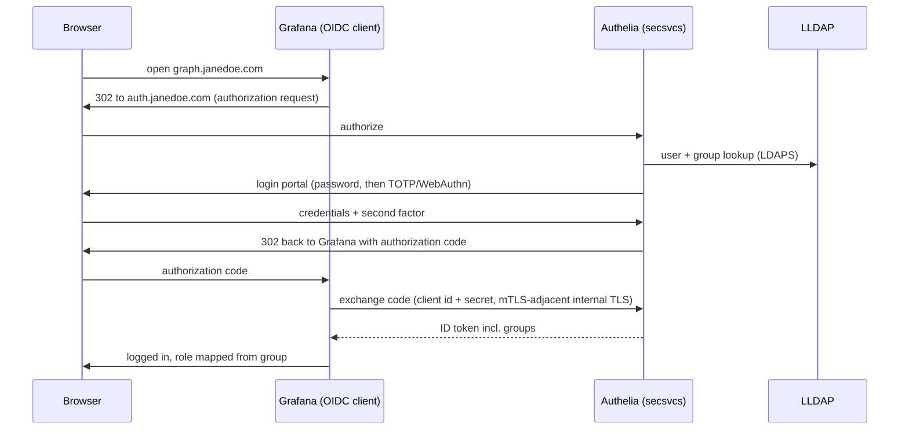
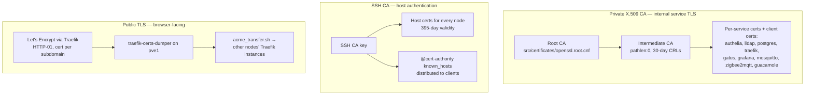

# Security

The security model layer by layer: edge filtering, the VPN boundary, identity,
TLS trust, host access, and secrets. Placeholder values from `vars.template.yml`
throughout.

Principles:

- **One front door.** The VPS is the only machine with a public IP; ports 80/443 are
  the only public service ports, and everything crossing them passes one HAProxy
  config before touching any application.
- **Default deny.** Authelia's access control starts at `default_policy: deny`;
  HAProxy's default backend silently drops; the SSH automation account can run only an
  enumerated command list.
- **Give attackers nothing.** Blocked traffic is `silent-drop`ped — no RST, no error
  page, no signal about what exists.
- **Trust is minted at home.** All certificates (X.509 and SSH) originate from CAs on
  pve1, the most protected host.

## The edge: HAProxy

HAProxy on the VPS filters before routing (config:
[`src/haproxy/haproxy.cfg.j2`](../src/haproxy/haproxy.cfg.j2)):

- **TLS hardening** — Mozilla intermediate profile: TLS 1.2/1.3 only, custom dhparam,
  session tickets disabled.
- **Layer-4 rate limiting** — per-source stick tables on the :443 TCP frontend:
  more than 30 concurrent connections or a connection rate over 50/3s → silent-drop.
  A 5s `inspect-delay` waits for the ClientHello and slows port scanners.
- **Sticky banning** — the :80 HTTP frontend tracks request rate; over 150 requests
  per 10s flags the source IP (`gpc0`), and flagged sources are dropped regardless of
  their subsequent rate until the table entry expires.
- **Geo-blocking** — countries listed in `vars.yml` are blocked via per-country map
  files generated daily from the MaxMind GeoIP database by the `geoip_generator`
  systemd timer.
- **Attack-path filtering** — HTTP requests for `.env`, `.git`, `.aws`, `wp-admin`,
  `phpmyadmin`, and similar scanner bait are silently dropped.

Because HAProxy never terminates TLS (see
[ADR 0002](adr/0002-haproxy-sni-passthrough.md)), a compromise of the VPS exposes
traffic metadata but not plaintext.

## The VPN boundary

Headscale (self-hosted Tailscale coordinator, see
[ADR 0003](adr/0003-self-hosted-headscale.md)) runs the WireGuard mesh that connects
the VPS, the VMs, and personal devices. HAProxy reaches backend VMs only through this
mesh — the home network never accepts inbound connections from the internet directly.
An embedded DERP relay covers peers that can't hole-punch.

**Current state, honestly:** the network layer is not yet zero-trust. The intended
group-based Headscale ACL matrix exists in
[`src/headscale/headscale_acl.hujson.j2`](../src/headscale/headscale_acl.hujson.j2)
but is marked "not currently in use" and the active policy is permissive (each
enrolled user gets broad access). The blocker is narrower than "ACLs don't work on
FreeBSD" implies: FreeBSD (pfSense) still can't disable SNAT on subnet routes, so
routed LAN traffic loses real source IPs at the router boundary; Headscale's ACL
policy engine itself is unaffected. See
[the tracked issue](../.scratch/architecture-audit/issues/03-headscale-acls-disabled.md)
for the upstream Tailscale PRs and workaround options. Enforced segmentation today
comes from pfSense VLAN firewall rules and Authelia's application-layer policies,
not from the mesh.

## Identity: LLDAP + Authelia

- **LLDAP** stores users and groups; Authelia reads it over LDAPS (internal CA cert).
- **Authelia** is the SSO portal and OIDC provider, backed by Postgres. Access rules
  escalate from one-factor to two-factor by group; TOTP and WebAuthn/passkeys are
  enabled, with zxcvbn password policy.

Two integration models:

1. **ForwardAuth** (apps with no real auth of their own): Traefik forwards every
   request to Authelia, which returns 200 or a 302 to the login portal. This is the
   default for all protected routes — the flow is shown in the
   [networking sequence diagram](networking.md#ingress-the-three-tier-chain).
2. **OIDC** (apps with native SSO support): Authelia is the issuer for six clients —
   Headscale (two-factor), Grafana, Home Assistant, Guacamole, Gatus, and OliveTin.
   OIDC gives the app group-based role mapping, not just a yes/no at the proxy.

OIDC client secrets are injected at container startup via the secrets pipeline; they
never appear in rendered configs on disk.

## TLS and trust hierarchy

Three trust systems, all rooted on pve1:

- **Internal TLS**: service-to-service connections (Authelia↔LLDAP, Authelia↔Traefik
  mutual TLS, Postgres, MQTT) use certs from the private two-tier CA. Certs and keys
  are distributed to `/etc/opt/<svc>/certificates/` by `commands.sh install_certs` /
  `install_keys`.
- **SSH host certs** eliminate trust-on-first-use: clients trust the CA once and every
  node's host key verifies automatically. A separate script handles the Windows
  gaming VM.
- **Public TLS**: Traefik on pve1 answers ACME challenges; the resulting certs are
  dumped and redistributed to the other nodes' Traefik instances.
- **Expiry monitoring**: the `cert_notifier` timer on pve1 emails weeks in advance;
  Gatus and vmalert also alert on approaching expiry. Rotation cadence lives in
  [Maintenance](maintenance.md#refresh-certificates).

## Host access: the SSH dispatcher

No config-management agent runs on the nodes (see
[ADR 0005](adr/0005-ssh-forced-command-dispatcher.md)). Remote administration uses two
accounts with sharply different powers:

- **`manualadmin`** — interactive SSH for a human: file uploads, exploratory work,
  full sudo with password.
- **`autoadmin`** — the automation account. Its SSH key is bound to a `ForceCommand`
  script, [`dispatcher.sh`](../src/secsvcs/dispatcher.sh), which whitelists a fixed
  set of `$SSH_ORIGINAL_COMMAND` strings (`install_traefik`, `install_all_svcs`,
  `copy_acme_certs`, …) and rejects everything else. Its sudoers entry, generated at
  render time from the dispatcher's own command list (`tools/parse_dispatcher.sh` →
  `sudoers.j2`), grants NOPASSWD for exactly those commands.

So automation (OliveTin buttons, deploy scripts, cert distribution) can trigger
predefined actions remotely, but a stolen `autoadmin` key cannot run arbitrary
commands. `tools/gen_dispatch_cmds.sh` regenerates dispatcher cases from
`install_svcs.sh` so the whitelist stays in sync with the services that exist.

## Secrets

SOPS + AGE, written to disk encrypted (see
[ADR 0004](adr/0004-sops-age-secrets.md)):

- One AGE keypair per VM; private keys live only on the host, never in git.
- SOPS encrypts YAML *values*, leaving keys readable — diffs stay meaningful.
- At container startup, `get_secret.sh` decrypts and extracts named values;
  `render_secrets.sh` renders `*.j2.j2` second-pass templates with those values in
  memory, writes the final config `chmod 400`, or feeds Podman secrets that surface
  at `/run/secrets/<name>`.
- Plaintext secrets never sit on disk between deploy and runtime, and never appear in
  environment variables or `podman inspect` output.
- Rotation: `src/pve1/secret_update.sh` re-renders and redistributes per node.

## VPS hardening

The one public machine gets extra care: SSH moved to port 2202 with `ufw deny 22`,
fail2ban with a custom jail, and only 80, 443, 3478 (STUN), and 41641 (WireGuard)
open. Headscale admin operations happen over localhost, not the public interface.

## Known gaps

- Headscale ACLs disabled (above) — network-layer zero trust is aspirational today.
- LLDAP↔Authelia mutual TLS is disabled pending a certificate CN fix; the connection
  is still LDAPS.
- ESP32-class IoT devices talk plaintext on their VLAN — TLS costs too much CPU/RAM
  there; containment relies on VLAN firewall rules.
- Wired VLAN enforcement waits on a managed switch.

These are tracked as issues under `.scratch/`.
