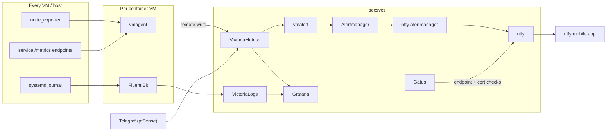

# Services

The full container catalog, host-level services, the observability stack, and the key
data flows. Hostnames use the placeholder domain `janedoe.com`; container subnets are
the placeholder values from `vars.template.yml`.

Every container is a Podman quadlet (`src/<service>/*.container`) with a static IP on
its VM's bridge network (see [ADR 0001](adr/0001-podman-quadlets-over-kubernetes.md)).
This catalog reflects what the repo defines; what is actually *running* on a node is
whichever services have been installed there via `install_svcs.sh` — check with
`systemctl list-units "*.service"` on the node. Regenerate the raw list any time with:

```bash
grep -r "IP=" src/*/*.container.j2
```

## secsvcs — identity, certificates, observability (pve1, 10.10.0.0/24)

| IP | Service | Image | Purpose | URL |
|-----|---------|-------|---------|-----|
| .3 | postgres | postgres | Authelia + Guacamole storage | pgdb (internal DNS only) |
| .4 | lldap | lldap | User/group directory | ldap.janedoe.com |
| .5 | authelia | authelia | SSO portal, OIDC provider | auth.janedoe.com |
| .6 | traefik | traefik | Node ingress, TLS termination | secproxy.janedoe.com |
| .7 | victoriametrics | victoriametrics | Metrics TSDB | metrics.janedoe.com |
| .8 | victorialogs | victorialogs | Log storage/query | logs.janedoe.com |
| .9 | gatus | gatus | Uptime + cert-expiry checks | uptime.janedoe.com |
| .10 | alertmanager | alertmanager | Alert routing | alert.janedoe.com |
| .11 | vmalert | vmalert | Alert rule evaluation | vmalert.janedoe.com |
| .12 | grafana | grafana-oss | Dashboards | graph.janedoe.com |
| .13 | ntfy | ntfy | Push notification server | push.janedoe.com |
| .14 | ntfy-alertmanager | ntfy-alertmanager | Alertmanager → ntfy bridge | ntfy-alertmanager.janedoe.com |
| .15 | olive_tin | olivetin | Web buttons for admin actions (via SSH dispatcher) | command.janedoe.com |
| .20 | fluentbit | fluent-bit | Journal → VictoriaLogs forwarder | — |

`vault` has an install stub but is not implemented (planned, see below).

## websvcs — user-facing web apps (pve2, 10.11.0.0/24)

| IP | Service | Image | Purpose | URL |
|-----|---------|-------|---------|-----|
| .6 | traefik | traefik | Node ingress, TLS termination | webproxy.janedoe.com |
| .7 | vmagent | vmagent | Local metrics scraper | — |
| .8 | nginx | nginx | Static site + error pages | www.janedoe.com, apex |
| .9 | homepage | homepage | Service dashboard | dash.janedoe.com |
| .10 | isso | isso | Blog comments | comment.janedoe.com |
| .11 | go2rtc | go2rtc | Camera restreaming | — |
| .15 | guacd | guacd | Guacamole protocol daemon | — |
| .16 | guacamole | guacamole | Browser remote desktop | remote.janedoe.com |
| .20 | fluentbit | fluent-bit | journald → VictoriaLogs forwarder | — |
| .50 | finance_exporter | built from babraham123/finance-exporter | Stock tickers as Prometheus metrics | — |

## homesvcs — home automation (pve1, 10.12.0.0/24)

| IP | Service | Image | Purpose | URL |
|-----|---------|-------|---------|-----|
| .6 | traefik | traefik | Node ingress, TLS termination | homeproxy.janedoe.com |
| .7 | vmagent | vmagent | Local metrics scraper | — |
| .8 | mosquitto | eclipse-mosquitto | MQTT broker | mqtt (internal DNS only) |
| .9 | zigbee2mqtt | zigbee2mqtt | Zigbee ↔ MQTT bridge | zigbee.janedoe.com |
| .10 | esphome | esphome | ESP device firmware manager | iot.janedoe.com |
| .11 | home_assistant | home-assistant | Home automation hub | home.janedoe.com |
| .20 | fluentbit | fluent-bit:3.2 | Journal → VictoriaLogs forwarder | — |

## Host-level services (not containerized)

| Host | Service | Purpose |
|------|---------|---------|
| container VMs | mdns_repeater | Bridge mDNS between VM NIC and Podman network |
| container VMs | node_exporter | Host metrics |
| pve1, pve2 | vm_watchdog | VM health watchdog |
| pve1 | cert_notifier (timer) | Email warnings before cert expiry (msmtp) |
| vpn | haproxy | Public ingress ([Networking](networking.md#ingress-the-three-tier-chain)) |
| vpn | headscale, tailscaled | Mesh VPN coordinator + client |
| vpn | geoip_generator (timer) | Daily GeoIP map refresh for HAProxy |
| router | Unbound, mDNS-Bridge, ntopng, Telegraf | DNS, discovery, traffic + metrics |

Proxmox web UIs are exposed internally as pve1/pve2/pbs2/router.janedoe.com through
Traefik's ACME route config.

## Observability

Metrics and logs converge on secsvcs; alerts end as phone push notifications.



- Scrape targets are auto-generated at render time from the service configs, so new
  services join monitoring without manual scrape config.
- Retention for metrics, logs, and Home Assistant history is set in `vars.yml`.
- Gatus is a second, independent path: HTTP checks with their own alerting, so a
  broken metrics pipeline doesn't mean silent outages. Cert expiry is watched by
  Gatus, vmalert, *and* the cert_notifier email timer.

## Key data flows

**Zigbee** — devices join the mesh through the SMLight SLZB-06 network coordinator,
which Zigbee2MQTT bridges onto Mosquitto topics; Home Assistant consumes and records
them, and entity state is exported onward as metrics to VictoriaMetrics.

**Remote admin** — OliveTin (command.janedoe.com, behind Authelia) presents buttons
that execute whitelisted commands over SSH as `autoadmin`, e.g. waking pve2 or
reinstalling a service. See [Security](security.md#host-access-the-ssh-dispatcher).

## Storage and backups

- Container state lives in named Podman volumes (`postgresdb`, `grafanadata`,
  `vmdata`, `vldata`, `ntfydb`, `hassdb`, `hassconfig`, `mqttdata`, `z2mdb`, …).
  VM disks are LVM-thin on each host's NVMe; guests use ext4. No ZFS or RAID —
  backups over redundancy.
- **Proxmox Backup Server** (`pbs2`, on pve2) backs up VM disks with prune/GC
  schedules.
- pfSense uses the Auto Config Backup package; PVE/PBS `/etc` is tarballed
  separately.
- Podman volume backup is a documented manual procedure (stop services in reverse
  order, archive volumes — see [the Podman guide](guides/podman.md.j2));
  VictoriaMetrics has its own backup procedure in
  [the secure services guide](guides/secure_services.md.j2).
