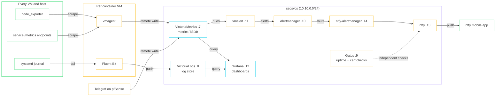

# Services

The full container catalog, host-level services, the observability stack, and the key
data flows. Hostnames use the placeholder domain `janedoe.com`; container subnets are
the placeholder values from `vars.template.yml`.

Every container is a Podman quadlet (`src/<service>/*.container`) with a static IP on
its VM's bridge network (see [ADR 0001](adr/0001-podman-quadlets-over-kubernetes.md)).
This catalog reflects what the repo defines; what is actually *running* on a node is
whichever services have been installed there via `install_svcs.sh`; check with
`systemctl list-units "*.service"` on the node. Regenerate the raw list any time with:

```bash
grep -r "IP=" src/*/*.container.j2
```

## secsvcs: identity, certificates, observability (pve1, 10.10.0.0/24)

| IP | Service | Image | Purpose | URL |
|-----|---------|-------|---------|-----|
| .3 | postgres | postgres | Authelia + Guacamole storage | pgdb (internal DNS only) |
| .4 | lldap | lldap | User/group directory | ldap.janedoe.com |
| .5 | authelia | authelia | SSO portal, OIDC provider | auth.janedoe.com |
| .6 | traefik | traefik | Node ingress, TLS termination | secproxy.janedoe.com |
| .7 | victoriametrics | victoriametrics | Metrics TSDB | metrics.janedoe.com |
| .8 | victorialogs | victorialogs | Log storage/query | logs.janedoe.com |
| .9 | gatus | gatus | Uptime + cert-expiry checks | uptime.janedoe.com |
| .10 | alertmanager | alertmanager | Alert routing | alert.janedoe.com |
| .11 | vmalert | vmalert | Alert rule evaluation | vmalert.janedoe.com |
| .12 | grafana | grafana-oss | Dashboards | graph.janedoe.com |
| .13 | ntfy | ntfy | Push notification server | push.janedoe.com |
| .14 | ntfy-alertmanager | ntfy-alertmanager | Alertmanager → ntfy bridge | ntfy-alertmanager.janedoe.com |
| .15 | olive_tin | olivetin | Web buttons for admin actions (via SSH dispatcher) | command.janedoe.com |
| .20 | fluentbit | fluent-bit | Journal → VictoriaLogs forwarder | n/a |

`vault` has an install stub but is not implemented (planned, see below).

## websvcs: user-facing web apps (pve2, 10.11.0.0/24)

| IP | Service | Image | Purpose | URL |
|-----|---------|-------|---------|-----|
| .6 | traefik | traefik | Node ingress, TLS termination | webproxy.janedoe.com |
| .7 | vmagent | vmagent | Local metrics scraper | n/a |
| .8 | nginx | nginx | Static site + error pages | www.janedoe.com, apex |
| .9 | homepage | homepage | Service dashboard | dash.janedoe.com |
| .10 | isso | isso | Blog comments | comment.janedoe.com |
| .11 | go2rtc | go2rtc | Camera restreaming | n/a |
| .15 | guacd | guacd | Guacamole protocol daemon | n/a |
| .16 | guacamole | guacamole | Browser remote desktop | remote.janedoe.com |
| .20 | fluentbit | fluent-bit | journald → VictoriaLogs forwarder | n/a |
| .50 | finance_exporter | built from babraham123/finance-exporter | Stock tickers as Prometheus metrics | n/a |

`nginx` serves static content out of `/var/opt/nginx/www`, mapped by subdomain
(`www/`, `wifi/`, and shared `error/` pages; see `src/nginx/nginx.conf.j2`).
`www` is a symlink to one of `/var/opt/nginx/releases/<UTC timestamp>/`, so a deploy or
rollback is an atomic symlink swap; the container mounts all of `/var/opt/nginx` at
`/srv` so the link resolves inside it.
That content is **not** in this repo: one example is the separate
[homesite](https://github.com/babraham123/homesite) repo, which builds and deploys via
its own `tools/deploy_src.sh`. This repo owns only the nginx config and quadlet.

## homesvcs: home automation (pve1, 10.12.0.0/24)

| IP | Service | Image | Purpose | URL |
|-----|---------|-------|---------|-----|
| .6 | traefik | traefik | Node ingress, TLS termination | homeproxy.janedoe.com |
| .7 | vmagent | vmagent | Local metrics scraper | n/a |
| .8 | mosquitto | eclipse-mosquitto | MQTT broker | mqtt (internal DNS only) |
| .9 | zigbee2mqtt | zigbee2mqtt | Zigbee ↔ MQTT bridge | zigbee.janedoe.com |
| .10 | esphome | esphome | ESP device firmware manager | iot.janedoe.com |
| .11 | home_assistant | home-assistant | Home automation hub | home.janedoe.com |
| .20 | fluentbit | fluent-bit:3.2 | Journal → VictoriaLogs forwarder | n/a |

## Host-level services (not containerized)

| Host | Service | Purpose |
|------|---------|---------|
| container VMs | mdns_repeater | Bridge mDNS between VM NIC and Podman network |
| container VMs | node_exporter | Host metrics |
| pve1, pve2 | vm_watchdog | VM health watchdog |
| pve1 | cert_notifier (timer) | Email warnings before cert expiry (msmtp) |
| vpnsvcs | haproxy | Public ingress ([Networking](networking.md#ingress-the-three-tier-chain)) |
| vpnsvcs | headscale, tailscaled | Mesh VPN coordinator + client |
| vpnsvcs | geoip_generator (timer) | Daily GeoIP map refresh for HAProxy |
| router | Unbound, mDNS-Bridge, ntopng, Telegraf | DNS, discovery, traffic + metrics |

Proxmox web UIs are exposed internally as pve1/pve2/pbs2/router.janedoe.com through
Traefik's ACME route config.

## Observability

Metrics and logs converge on secsvcs; alerts end as phone push notifications.


```mermaid
flowchart LR
    subgraph sources["Every VM and host"]
        ne["node_exporter"]
        sm["service /metrics endpoints"]
        jd["systemd journal"]
    end

    tg["Telegraf on pfSense"]

    subgraph agents["Per container VM"]
        vmagent["vmagent"]
        fb["Fluent Bit"]
    end

    subgraph sec["secsvcs (10.10.0.0/24)"]
        vm["VictoriaMetrics .7<br/>metrics TSDB"]
        vl["VictoriaLogs .8<br/>log store"]
        va["vmalert .11"]
        am["Alertmanager .10"]
        nam["ntfy-alertmanager .14"]
        ntfy["ntfy .13"]
        graf["Grafana .12<br/>dashboards"]
        gatus["Gatus .9<br/>uptime + cert checks"]
    end

    phone["ntfy mobile app"]

    ne -- "scrape" --> vmagent
    sm -- "scrape" --> vmagent
    jd -- "tail" --> fb
    vmagent -- "remote write" --> vm
    tg -- "remote write" --> vm
    fb -- "push" --> vl
    vm -- "rules" --> va
    va -- "alerts" --> am
    am -- "route" --> nam
    nam --> ntfy
    ntfy -- "push" --> phone
    vm -- "query" --> graf
    vl -- "query" --> graf
    gatus -. "independent checks" .-> ntfy

    style sources stroke:#4ade80,stroke-width:2px,fill:transparent
    style agents stroke:#fbbf24,stroke-width:2px,fill:transparent
    style sec stroke:#a78bfa,stroke-width:2px,fill:transparent
    classDef src stroke:#4ade80,fill:transparent
    classDef agent stroke:#fbbf24,fill:transparent
    classDef data stroke:#22d3ee,fill:transparent
    class ne,sm,jd,phone src
    class tg,vmagent,fb,va,am,nam,ntfy,gatus agent
    class vm,vl,graf data
```

- Scrape targets are auto-generated at render time from the service configs, so new
  services join monitoring without manual scrape config.
- Retention for metrics, logs, and Home Assistant history is set in `vars.yml`.
- Gatus is a second, independent path: HTTP checks with their own alerting, so a
  broken metrics pipeline doesn't mean silent outages. Cert expiry is watched by
  Gatus, vmalert, *and* the cert_notifier email timer.

## Key data flows

**Zigbee.** Devices join the mesh through the SMLight SLZB-06 network coordinator,
which Zigbee2MQTT bridges onto Mosquitto topics; Home Assistant consumes and records
them, and entity state is exported onward as metrics to VictoriaMetrics.

**Remote admin.** OliveTin (command.janedoe.com, behind Authelia) presents buttons
that execute whitelisted commands over SSH as `autoadmin`, e.g. waking pve2 or
reinstalling a service. See [Security](security.md#host-access-the-ssh-dispatcher).

## Storage and backups

- Container state lives in named Podman volumes (`postgresdb`, `grafanadata`,
  `vmdata`, `vldata`, `ntfydb`, `hassdb`, `hassconfig`, `mqttdata`, `z2mdb`, …) and
  under `/etc/opt` and `/var/opt`. VM disks are LVM-thin on each host's NVMe; guests
  use ext4. No ZFS or RAID for the VMs; backups over redundancy.
- The media array on pve2 (four HDDs on a passed-through SATA card, snapraid parity,
  mergerfs union, owned by websvcs) is the exception: media is not backed up, parity
  is its protection. [pve2 storage guide](guides/pve2_storage.md).
- **One weekly run**, Saturday 02:00, by `backup_orchestrator.service` on pve1. It
  wakes pve2 (PBS lives there) and runs, in order:
  1. `backup.sh` on every node (secsvcs, homesvcs, websvcs, vpnsvcs, then pve1 and
     pve2), through the SSH dispatcher as `backup`. Each node's script stages what is
     worth keeping under `/var/opt/backups/`: application dumps under `dumps/`
     (`pg_dumpall`, Home Assistant's native backup, a consistent Headscale SQLite
     snapshot) and plain copies of its config trees and small volumes under `files/`,
     paths as on the live system. Large or rebuildable data is left out by name in each
     script. pve1 mirrors `files/` into `/root/backups/<node>/` and moves the dumps
     there; the node keeps nothing but its newest dump.
  2. On pve1 and pve2 the same `backup.sh` continues with the VM images, to PBS through
     the API (`pvesh create /nodes/<n>/vzdump`), snapshot mode. On pve2 devtop and gaming
     share the GPU, so the running one is backed up, shut down, the other backed up,
     and the first started again.
  3. `proxmox-backup-client backup` from pve1, encrypted with the client key
     `/root/secrets/pbs_client.key`: `/root/backups/vpnsvcs` as `host/vpnsvcs` in
     namespace `pve1` (it stands in for the VPS's image), the rest of `/root/backups`
     as `host/pve1` in namespace `files`. Once both succeed the dumps are deleted from
     pve1: from then on they exist only in PBS. `/root/backups/repo/` holds the repo and
     `vars.yml`, written by every `tools/deploy_src.sh`.
  4. `prune.sh` on pve2 (dispatcher command `prune`): the PBS prune jobs, then garbage
     collection. Last, so the snapshots just made count, and inside the run because PBS
     is only up during it.
  5. A `homelab_backup_last_success_timestamp_seconds{job}` metric per step,
     `BackupStale` after 8 days (`src/vmalert/configs/backups.yml`), an ntfy summary,
     and pve2 off again if it was off.
- Retention, applied by pve2's `prune.sh` as PBS prune jobs, one per namespace:
  images (`pve1`, `pve2`, including `host/vpnsvcs`) keep last 1, weekly 2, monthly 2;
  `files` keep last 1, weekly 3, monthly 6.
- pfSense also uses the Auto Config Backup package. PVE and PBS configs (`/etc/pve`,
  `/etc/proxmox-backup`) are in the hosts' stages, so PBS's own config is kept
  outside PBS.
- Restores, from the node's stage, pve1's collection or PBS, for a file, a VM or a
  host: [the restore guide](guides/restore.md).
